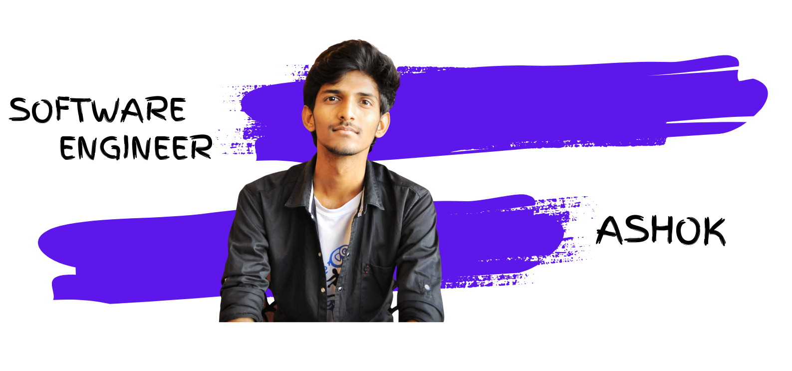

 

  <samp>
    Hi there, I'm Ashok! 👋  
    🔥 Software Developer grinding hard to make something cool   
    :sparkles: Favorite Tech: JavaScript, React, Typescript, Nodejs ...  
    :email:	ashokkumaravel02@gmail.com  
    :art: Portfolio: https://iashokk.github.io/Personal-Website/  
    :briefcase: LinkedIn: https://www.linkedin.com/in/ashok-k17/  
                Twitter: https://twitter.com/im_ashxk
  </samp>

## Languages and Tools
Here are some of the technologies and tools I work with:

- Programming Languages: [insert languages, e.g., Python, JavaScript, Java]
- Frameworks: [insert frameworks, e.g., React, Angular, Django]
- Tools: [insert tools, e.g., Git, Docker, Kubernetes]

## Projects
Here are a few projects I've worked on:

- [Project 1](link to project): Brief description of what the project is about.
- [Project 2](link to project): Brief description of what the project is about.
- [Project 3](link to project): Brief description of what the project is about.

## GitHub Stats

## Get in Touch
Feel free to connect with me:

- [LinkedIn](link to your LinkedIn profile)
- [Twitter](link to your Twitter profile)
- [Email](your email address)

Thanks for visiting my profile! Have a great day! 😊

